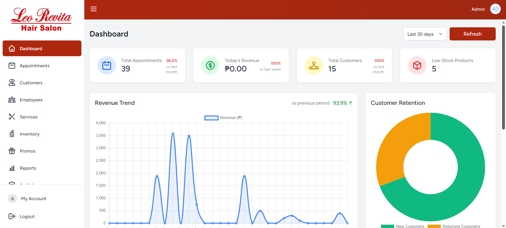
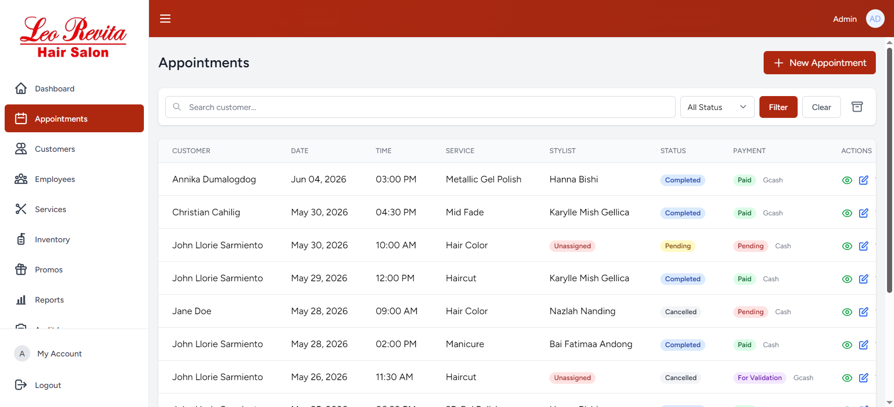
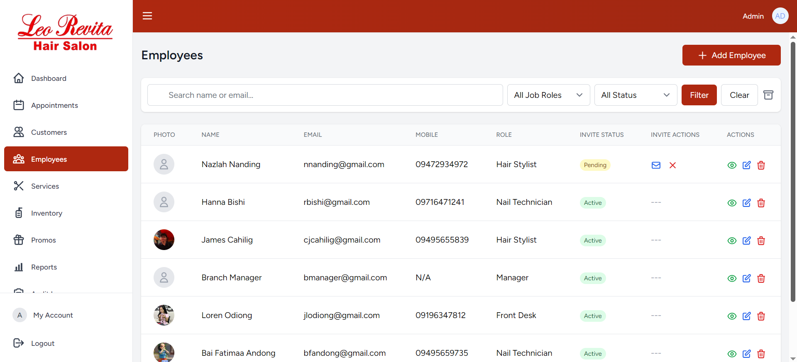
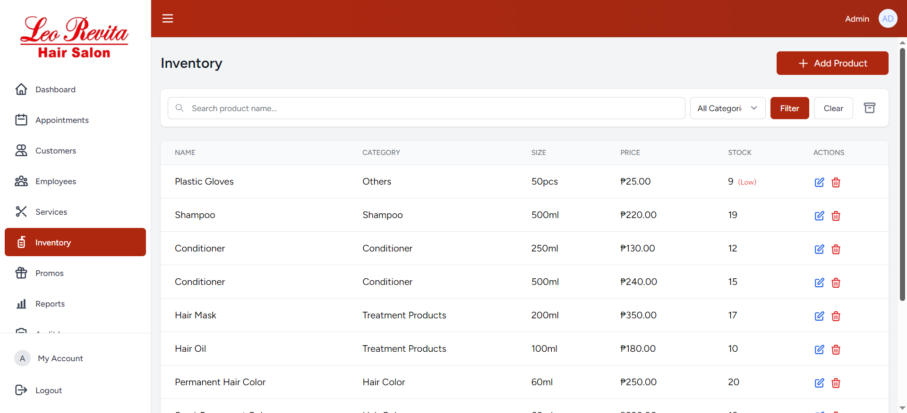
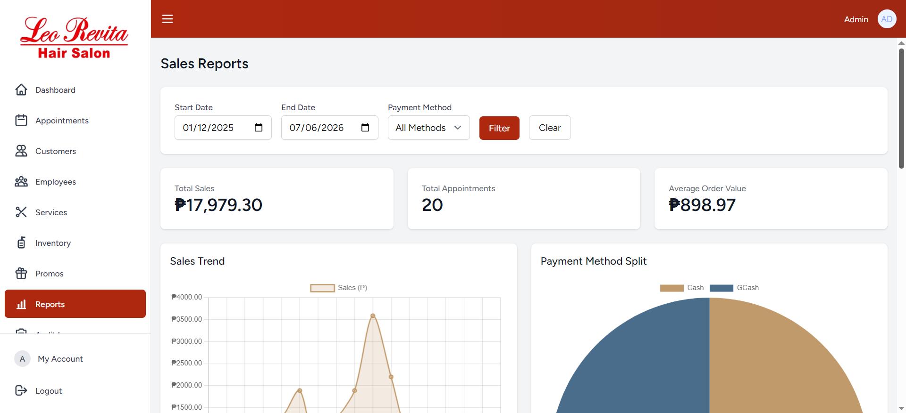

# Hair Salon Management System

### Appointment Scheduling and Business Operations Platform

The Hair Salon Management System is a web-based application developed to streamline salon operations by centralizing appointment scheduling, customer management, employee administration, inventory tracking, and sales monitoring.

## Overview

Many small and medium-sized salons still rely on manual processes for managing appointments, inventory, and customer records. This project was developed to digitize these operations, improve efficiency, and provide salon owners with better visibility into daily business activities.

The system enables staff and administrators to manage appointments, monitor inventory levels, track sales, and maintain customer records through a centralized platform.

## Features

### Appointment Management

- Appointment scheduling
- Booking management
- Service tracking
- Schedule monitoring

### Customer and Employee Profile Management

- Customer profiles
- Service history
- Contact information management

### Inventory Management

- Product inventory tracking
- Stock monitoring
- Inventory updates

### Sales and Reporting

- Sales tracking
- Transaction monitoring
- Business reports
- Operational analytics

## Technologies Used

- Laravel
- PHP
- MySQL
- HTML
- CSS
- JavaScript
- Bootstrap
- XAMPP

## Project Motivation

The project was developed to address operational inefficiencies caused by manual appointment booking, inventory monitoring, and customer record management. By centralizing these processes into a single system, the salon can improve customer service, reduce administrative workload, and gain valuable business insights.

## Screenshots

### Landing


### Dashboard



### Appointment Management



### Profile Management



### Inventory Monitoring



### Reports



## Installation

### Requirements

- PHP 8+
- Composer
- MySQL
- Laravel

### Setup

Clone the repository:

```bash
git clone <repository-url>
```

Install dependencies:

```bash
composer install
```

Copy environment file:

```bash
cp .env.example .env
```

Generate application key:

```bash
php artisan key:generate
```

Configure database settings in:

```text
.env
```

Run migrations:

```bash
php artisan migrate
```

Start the development server:

```bash
php artisan serve
```

## Future Improvements

- Online booking integration
- SMS appointment reminders
- Customer loyalty system
- Analytics dashboard enhancements
- Mobile-responsive improvements

## Contributors

This project was developed as part of a group project.

### Team Members

- Christian James Cahilig
- Bai Fatima Andong
- Karylle Mish Gellica

## My Contributions

- System analysis and requirements gathering
- Database design and implementation
- Laravel application development
- Appointment management module development
- Inventory management implementation
- Testing and debugging
- Documentation

## Learning Outcomes

This project strengthened my understanding of:

- Laravel Framework
- MVC Architecture
- Database Design
- Full-Stack Web Development
- Business Process Analysis
- Software Testing
- System Documentation
